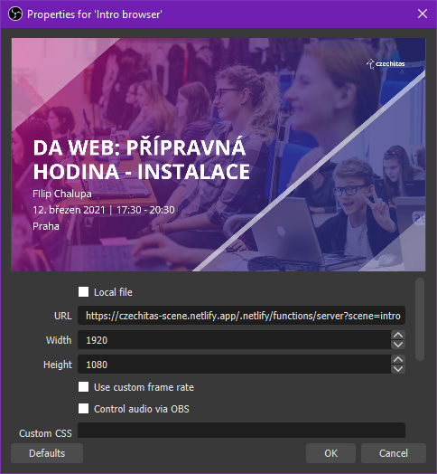

# Dynamický konfigurátor scén

Backend pro [konfigurátor slidu](https://github.com/Czechitas-podklady-WEB/Konfigurator-slidu). Automaticky bere z rozvrhu informace o nejbližší nadcházející lekci a zobrazí je jakou webovou stránku ve stylu slidu Czechitas.

Doporučený poměr stran prohlížeče je 16:9 (1920x1080 pixelů). Jiné rozměry mohou způsobit ořez v levém a pravém kraji.

Odkazy níže jsou vhodné například pro [OBS](https://obsproject.com/) scény.



## Scény

```bash
npm ci && GOOGLE_API_KEY='AI…' SHEET_ID='12gf…' npm start
```

### Lokálně

- Úvodní: http://localhost:3000/?scene=intro
- Přestávka: http://localhost:3000/?scene=break
- Konec: http://localhost:3000/?scene=outro

---

- Vlastní datum: http://localhost:3000/?date=16.9.2020

### Veřejné adresy pro pražskou digitální akademii

- **Úvodní**: https://czechitas-scene.netlify.app/.netlify/functions/server?scene=intro
- Přestávka: https://czechitas-scene.netlify.app/.netlify/functions/server?scene=break
- Konec: https://czechitas-scene.netlify.app/.netlify/functions/server?scene=outro

## Potřebné env proměnné:

- GOOGLE_API_KEY (https://developers.google.com/sheets/api/quickstart/nodejs)
- SHEET_ID (lze získat z adresního řádku tabulky)
